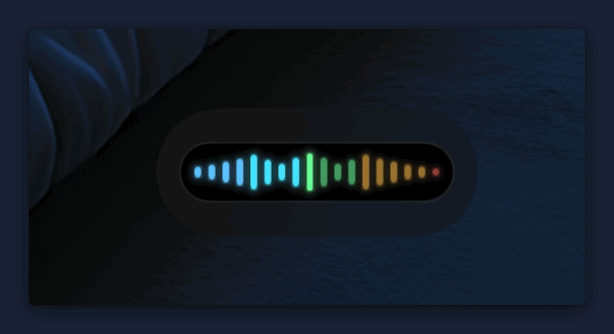
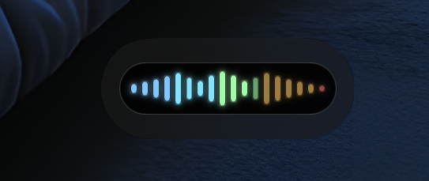
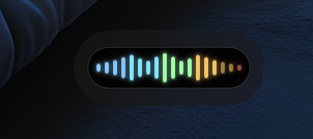
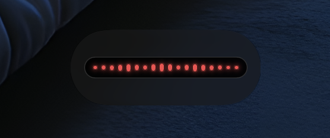

# Micky


[](LICENSE)

A macOS menu bar microphone meter with a floating, always-on-top waveform overlay. Micky was made to help you keep your microphone level in a good range so you can sound clear and consistent on video calls. Audio is measured locally and never recorded or saved.



## 🎙️ About Micky

### ✨ Features

- Live short-term peak level in dBFS; hover over the waveform to see the reading.
- Follow the system input or choose an available Core Audio microphone.
- Drag the overlay to move it. It stays above other windows, joins every Space, and remembers its position.
- When the selected microphone is muted, the waveform turns red and the menu bar icon changes.
- Liquid Glass on macOS 26 and later; translucent material on earlier supported versions.

### 🎛️ Menu bar controls

| Control | Action |
| --- | --- |
| Pause / Resume Meter | Stop or restart level monitoring |
| Show Overlay | Bring the waveform overlay forward |
| Settings | Choose a microphone and adjust overlay appearance and position |
| Quit Micky | Close the app |

Settings does not open automatically when Micky launches.

### 📊 Level guide

| Peak level | Guide | Overlay color |
| --- | --- | --- |
| Below −30 dBFS | Very quiet | 🩵 Light blue |
| −30 to −18 dBFS | Low | 🔹 Cyan |
| −18 to −6 dBFS | Useful call level | 🟢 Green |
| −6 to −1 dBFS | Loud | 🟠 Amber |
| −1 dBFS or higher | Near clipping | 🔴 Coral red |

dBFS measures digital headroom, not acoustic loudness. Call apps may adjust microphone gain, so use their own mic test too. When the microphone is muted, the entire waveform turns red.

### 🖼️ Volume examples

| Good call level | Loud | Muted |
| :---: | :---: | :---: |
|  |  |  |

#### Overlay opacity

| Opaque | Semi-transparent | Transparent |
| :---: | :---: | :---: |
|  |  |  |

Wallpaper in these examples: **Summit** by [Basic Apple Guy](https://basicappleguy.com/basicappleblog/summit).

### ⚙️ Settings

- **Input:** System Default or an available microphone.
- **Opacity:** 100% is opaque black; lower values blend the background with the desktop.
- **Size and position:** Adjust the overlay scale and horizontal or vertical placement.
- **Level guide:** See the colors and their corresponding dBFS ranges.

### 🔐 Permissions and data

- **Microphone:** Required to read input levels. Micky analyzes audio samples in memory to calculate the current peak, then discards them. It does not record, save, or transmit audio.
- **Other permissions:** None required.
- **Saved locally:** Microphone selection and overlay settings (opacity, scale, and position) are stored in macOS preferences.

Allow microphone access at the first prompt. To change it later, use **System Settings → Privacy & Security → Microphone**.

## 📥 Download and build

### 📦 Prebuilt version

Download the versioned `Micky-*-macos.zip` asset from [GitHub Releases](https://github.com/vardecab/micky/releases), unzip it, and move `Micky.app` to Applications. Open it and allow microphone access when prompted.

**About the macOS security warning:** The release is not notarized by Apple. Notarizing a Mac app for distribution outside the App Store requires enrollment in Apple's paid Developer Program, which this project does not have. As a result, Gatekeeper may say it cannot verify the app or check it for malicious software. This warning reflects the app's notarization status; it is not a malware scan result. Download Micky from the official releases page, and review the source if you want to inspect it. To open it, Control-click `Micky.app`, choose **Open**, then confirm. If no release is listed yet, build from source below.

### 🛠️ Build from source

Requires macOS and Xcode Command Line Tools. From this folder, run:

```sh
./build-and-run.sh
```

It builds Micky, installs or updates `/Applications/Micky.app`, then launches it in the background. It may request administrator approval to update Applications. Build output is shown in the terminal and saved to `build.log`.

### 🚀 Publish a release

Requires GitHub CLI (`gh`) authenticated to this repository and a clean, up-to-date `main` branch. To publish the current version for the first time, run `./release.sh current`. For later releases, choose a SemVer bump:

```sh
./release.sh patch   # increment patch
./release.sh minor   # increment minor, reset patch
./release.sh major   # increment major, reset minor and patch
```

`current` publishes the version already in `Info.plist`. A SemVer bump updates version metadata and the README. The script builds a zip for the Mac's architecture, commits and pushes version changes when needed, then creates a GitHub release with generated notes.

## 🧭 Project

### 🗂️ Version history

App versions follow Semantic Versioning (`MAJOR.MINOR.PATCH`). The macOS build number increments separately.

#### 1.1.0

- Keep Settings closed at launch; access app controls from the menu bar.
- Add `icons/mic.png` as the app bundle icon.
- Save build output to `build.log` and launch Micky in the background.

#### 1.0.0

- Initial version with the menu bar meter, floating waveform, microphone selection, overlay settings, mute indication, and live dBFS readout.

### 📜 License and attribution

Micky's original code is licensed under the [PolyForm Noncommercial License 1.0.0](LICENSE). Personal and other noncommercial use, including forks and changes, is allowed. Commercial use requires separate permission. This is a source-available license, not an OSI-approved open-source license. Keep the copyright notice and license with redistributed copies.

Third-party assets have separate terms; see [THIRD_PARTY_NOTICES.md](THIRD_PARTY_NOTICES.md). If you make a fork or adapt Micky, I’d love to hear what you did in a [GitHub issue](https://github.com/vardecab/micky/issues), but that’s optional.
